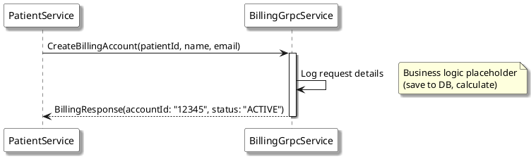

# CreateBillingAccount (gRPC)

## Назначение

Создание нового финансового счета для пациента. Метод вызывается `patient-service`.

## Протокол вызова

```protobuf
rpc CreateBillingAccount (BillingRequest) returns (BillingResponse);

```

## Параметры вызова

**Сервис:** `billing.BillingService`

**Метод:** `CreateBillingAccount`

**Тип вызова:** Unary 

### Входные параметры (BillingRequest)

| Поле | Тип | Обяз. | Описание |
| --- | --- | --- | --- |
| `patientId` | string | Да | UUID пациента из системы Patient Service |
| `name` | string | Да | Полное имя пациента для привязки к счету |
| `email` | string | Да | Контактный email для финансовых уведомлений |

### Выходные параметры (BillingResponse)

| Поле | Тип | Описание |
| --- | --- | --- |
| `accountId` | string | Уникальный номер созданного счета (ID в биллинге) |
| `status` | string | Текущий статус аккаунта (напр., `ACTIVE`) |

**Request:**

```json
{
  "patientId": "550e8400-e29b-41d4-a716-446655440000",
  "name": "Иван Иванов",
  "email": "ivanov@example.com"
}

```

**Response:**

```json
{
  "accountId": "12345",
  "status": "ACTIVE"
}

```

## Коды ответов

| Код | Статус | Описание |
| --- | --- | --- |
| **0** | `OK` | Счет успешно создан. |
| **3** | `INVALID_ARGUMENT` | Ошибка валидации полей (например, пустой email). |
| **14** | `UNAVAILABLE` | Сервис биллинга временно недоступен. |

## Алгоритм работы

1. Библиотека grpc-netty-shaded принимает входящий TCP-пакет на порту 9001. HTTP/2 фреймы извлекаются и передаются в стек обработки gRPC.


2. Библиотека protobuf-java выполняет десериализацию бинарных данных из тела запроса в Java-объект BillingRequest. Если структура данных повреждена, gRPC нативно возвращает статус-код 13 INTERNAL.


3. grpc-spring-boot-starter находит компонент, помеченный аннотацией @GrpcService, и передает управление методу createBillingAccount класса BillingGrpcService.

Логирование: С помощью SLF4J выполняется запись в лог уровня INFO: createBillingAccount request received {данные_запроса}. В лог попадают значения полей patientId, name и email, полученные из billingRequest.toString().

Исполнение бизнес-логики (Mock): В текущей реализации интеграция с базой данных или внешней платежной системой отсутствует. Сервис выполняет роль заглушки (mock).

Сборка ответа через Builder: С помощью сгенерированного класса BillingResponse.Builder формируется ответный объект:

setAccountId("12345"): устанавливается статичный идентификатор счета.

setStatus("ACTIVE"): устанавливается статичный статус.

Метод build() создает итоговый объект BillingResponse.

Передача ответа в поток (StreamObserver): Метод responseObserver.onNext(response) передает объект BillingResponse обратно в gRPC-инфраструктуру. На этом этапе данные сериализуются в бинарный формат Protobuf.

Завершение стрима: Вызов метода responseObserver.onCompleted() сигнализирует вызывающей стороне (patient-service), что обработка запроса завершена успешно. Клиент получает статус-код 0 OK.

1. Прием сообщения `BillingRequest`.
2. Логирование входящего запроса (вывод в консоль параметров пациента).
3. [Mock-логика] Генерация системного `accountId` (в текущей реализации всегда "12345").
4. [Mock-логика] Присвоение статуса "ACTIVE".
5. Формирование и отправка `BillingResponse`.

## Sequence Diagram (SQD)


